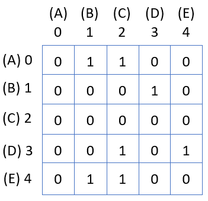

# Individual Assignment: Graph Matrix

## Overview

In this assignment, we will explore one of the common ways to store graph data in an application. 
Using a two-dimensional array, we store the edges in a graph. This is a good choice for dense graphs.


## Objectives

Here is what we'd like you take out of this assignment.

### Course
- Implement a graph data structure using an adjacency list or adjacency matrix.

### Module
- To demonstrate how to access row/column data in a two-dimensional array.
- To write a complex data structure using other sub-structures for support.
- To write a Java class that stores data from different types of networks.

## Getting Started

You have been provided with starter files in your project. Take a moment to review 
the interfaces and classes:
- `IGraph` - an interface describing the basic behavior of a graph.
- `Edge` - a simple class that stores a pair of vertices that form an edge and the weight of that edge.
- `Bijection` - A two-way map structure where keys & values are stored and a key or value can be provided 
  to find a pair in the map.
    - Note: This means that both your keys are unique and your values are unique.
    - Note: This type of structure is called a one-to-one correspondence in mathematics.
- `GraphsTest` - A file with unit tests to verify the behavior of your class.

## Adjacency Matrix

Your task is to write a graph structure that is based upon a matrix, as described in class. 
To implement such a structure in Java will require you to manage a two-dimensional array.

&nbsp;&nbsp;&nbsp;


To declare a grid of elements as a two-dimensional array in Java you write a statement like the
following:

```java
int[][] matrix = new int[rows][columns];
```

You should also notice that there is a mapping of vertices to indices in the diagram:

- A -> 0
- C -> 2
- D -> 3
- ...

We can use these mapped indices to place an edge in the graph, which is represented by a 
non-zero value. For example, if we want to add edge (C, D) to the graph, we would use
the mapping to find the corresponding indices in the graph and update the array. For
example:

```java
//add an edge with weight 1
matrix[2][3] = 1;
```

## Graph Properties

To create a general class for a type of graph requires us to identify the properties
of that type of graph. For this assignment our graph will have the following properties:

- The graph is directed.
- The graph is a weighted graph, where edge weights replace the value one in the matrix above. 
- Non-positive edge weights are not supported, and a missing edge is stored as 0.

## The IGraph Interface

The expected operations of your class are defined in the `IGraph` interface. When implementing
the class, you should directly follow the Javadoc descriptions that are provided.


## Managing Indices

It can be particularly challenging to assign new vertices to the graph using the 
two-dimensional array. Vertices could be colors, cars, nations, cities, etc., 
depending on the graph. You will need to maintain a mapping from vertices to indices
For example, given the insertion of color-vertices in the following order - 
`pink, magenta, blue, green` - your program could assign indices in insertion order:


Notice how a new element would be assigned index 5, then 6, and so on. This works well, but 
what if we ended up deleting a vertex? For example, deleting blue from the graph above:


Notice how we have an empty space in our graph. We should not leave this as unused space in the graph. 
Instead, we should reassign indices from deleted elements as necessary. This can be challenging to 
accomplish if we pick the wrong data structure. 

A stack can be used to solve this problem. With the following steps:

- The stack should initially store the index 0.
- When a request is made to insert a new vertex to the graph, pull the top number off the stack. 
  This is the index of the new vertex.
  - If the stack is now empty, increment the last index pulled from the stack and add this 
    value back onto the stack.
  - If the stack is not empty, do nothing. There is an index still available for the next 
    vertex added to the graph.

## Using the Bijection

To help map vertices to indices, your instructor has provided the code for a two-way map. This 
structure will be necessary for most of the methods you will write. In certain cases you will need to 
use a vertex to identify the corresponding index in the matrix. In other cases you will do the opposite, 
using an index to find the corresponding vertex. 


**Note:** The Bijection class allows you to search by key or value in constant time (at the cost of 
some extra space). You should take a moment and familiarize yourself with the code for the class. 
Your code is required to provide O(1) look up time when identifying the index of a vertex 
(or the opposite, a vertex at an index).

## Making Room for More Elements

Your graph should continuously grow to accommodate more vertices. If addVertex() is invoked 
on a matrix with no more row/columns for a new vertex, then the matrix should be replaced 
with a larger matrix.


Given the size of the internal array, you should be conservative with how quickly you 
allow it to grow. A growth factor should be provided in your
program in the 30-50% range. 

## Verifying Your Work

Your instructor has provided a set of unit tests to verify the behavior of your class. 
It will be beneficial to observe how I have written the tests, as guidance when writing 
your graph methods.

## Requirements

The following are hard-requirements for the assignment. Any submissions ignoring these 
rules will be required to resubmit their work:
- Your graph must be directed, weighted, and use an adjacency matrix.
- Your class must use a two-dimensional array to store elements in the matrix.
- You should not be storing any Edge objects in the fields in your class. This includes lists, sets, 
  or maps that store Edge objects. 
  - **Note:** The only place an Edge object should be created is within 
    your edges() method.